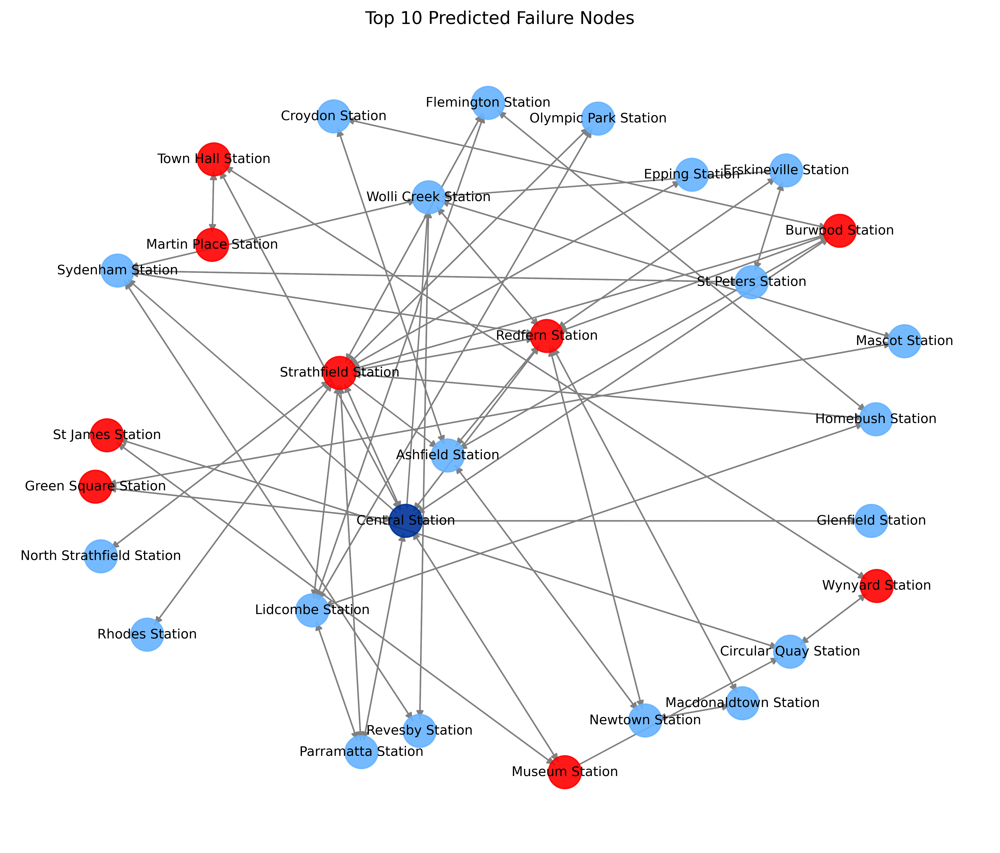
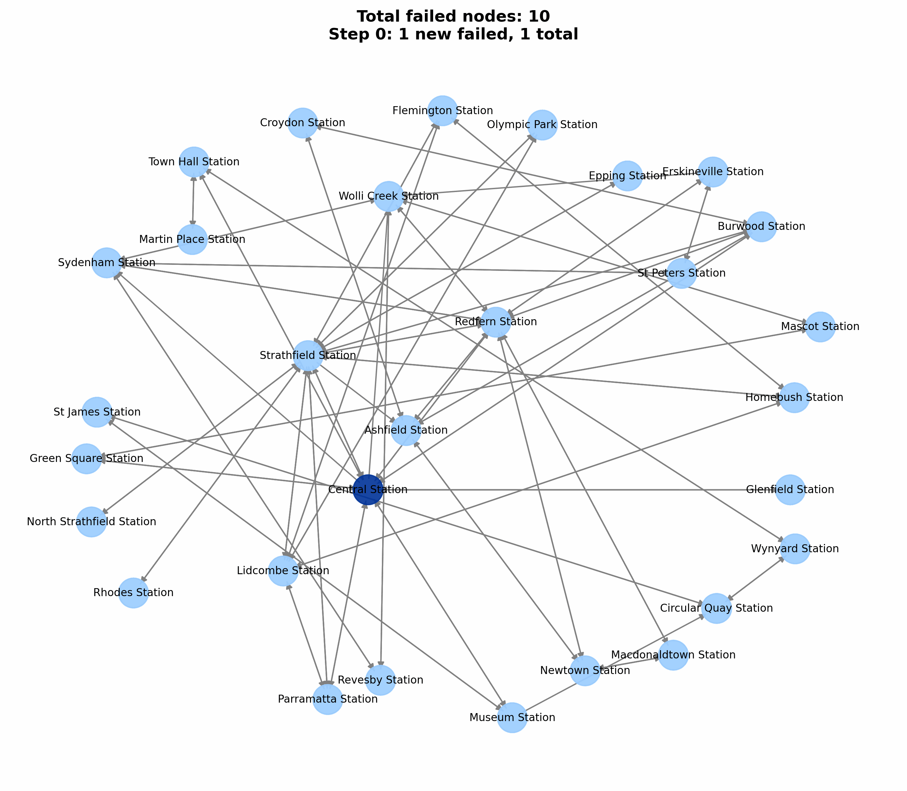

# 🚆 GNN-based Cascading Failure Simulation on Sydney Train Network

This project presents a Graph Neural Network (GNN) framework for simulating and predicting cascading failures in the Sydney Train Network. It includes a PyTorch Geometric-based model and a PyQt5-powered interactive interface that enables users to select seed failure nodes, visualize prediction risks, and animate failure propagation.

## 📌 Features

- Construct directed graphs from real-world GTFS data
- Train a GNN model to predict failure risks across stations
- Simulate cascading failures under threshold dynamics
- Visualize top-10 vulnerable nodes
- Interactive PyQt5 interface with multi-select node dropdown
- High-resolution network visualization and GIF-based animation

## 📁 Project Structure

```
├── Gui.py                        # PyQt5 GUI interface
├── 1_generate_samples_multiseed.py   # Generate training/testing data
├── 2_train_model.py             # Train the GNN model
├── 3_predict_probabilities.py   # Generate predictions
├── gnn_model.py                 # GCN architecture
├── gnn_utils.py                 # Data loading utilities
├── gnn_cascading_pipeline.py    # End-to-end cascade simulation logic
├── samples/                     # Folder for generated node/edge data
├── models/                      # Trained GNN model weights
├── outputs/                     # Prediction images and animation GIFs
```

## 🚀 Getting Started

### 1. Clone the repository

```bash
git clone https://github.com/ConggaiLi-csiro/CIPR_Seed-Funding.git
cd CIPR_Seed-Funding
```

### 2. Install dependencies

Make sure you have Python 3.9 or higher. Install required packages:

```bash
pip install -r requirements.txt
```

Or, if you use Conda:

```bash
conda env create -f environment.yml
conda activate gnn-cascading-env
```

### 3. Run the GUI

```bash
python Gui.py
```

When launched, the GUI will:

- Generate training data (if not already present)
- Train the GNN
- Predict station failure probabilities
- Allow interactive simulation and visualization

## 🧠 GNN Model Overview

- **Architecture**: 2-layer Graph Convolutional Network (GCN)
- **Input**: Binary vector indicating initially failed stations
- **Output**: Failure probabilities for each node
- **Loss**: Binary cross-entropy

## 🎯 Cascading Simulation

- A node fails if ≥40% of its neighbors have failed
- Simulation continues until no new failures occur
- Supports single-seed and multi-seed initialization
- Cascading steps are visualized as an animated GIF

## 📊 Example

- Initial failure at `Central Station`
- Top-10 high-risk stations predicted
- Cascading failure progression over multiple steps




## 📦 Dependencies

- Python 3.9+
- PyTorch & PyTorch Geometric
- NetworkX
- pandas, numpy, matplotlib
- PyQt5
- imageio, Pillow

## 📈 Use Cases

- Infrastructure resilience planning
- Critical node identification
- Risk-aware network operations
- Education and demonstration of cascading dynamics

## 📄 License

MIT License. See `LICENSE` for details.

## 🙋 Contact

For any questions or contributions, feel free to reach out to:

**Dr. Conggai Li**  
Email: Conggai.li@csiro.au  
CSIRO, Australia
